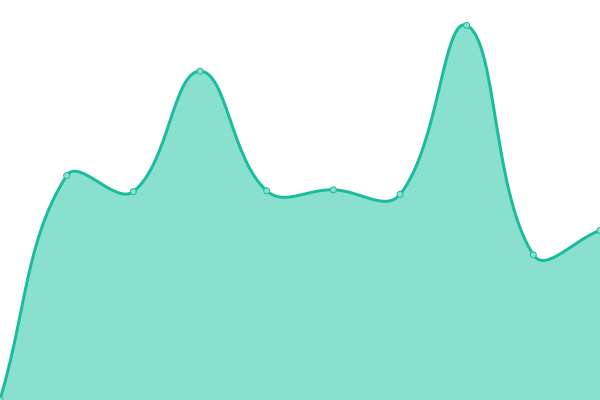

# [📈 Live Status](https://demo.upptime.js.org): <!--live status--> **🟩 All systems operational**

This repository contains the open-source uptime monitor and status page for [iamipro](https://demo.upptime.js.org), powered by [Upptime](https://github.com/upptime/upptime).

With [Upptime](https://upptime.js.org), you can get your own unlimited and free uptime monitor and status page, powered entirely by a GitHub repository. We use [Issues](https://github.com/iamipro/monitory/issues) as incident reports, [Actions](https://github.com/iamipro/monitory/actions) as uptime monitors, and [Pages](https://demo.upptime.js.org) for the status page.

<!--start: status pages-->
<!-- This summary is generated by Upptime (https://github.com/upptime/upptime) -->
<!-- Do not edit this manually, your changes will be overwritten -->
<!-- prettier-ignore -->
| URL | Status | History | Response Time | Uptime |
| --- | ------ | ------- | ------------- | ------ |
|  [Crawling](http://www.lmshi.shop:5000) | 🟩 Up | [crawling.yml](https://github.com/MyoungSoo7/monitory/commits/HEAD/history/crawling.yml) | 

 1562ms
     
 | 

<a href="https://MyoungSoo7.github.io/monitory/history/crawling">68.11%</a>
    

|  [PharmacyRecommend](http://www.lmshi.shop:8081) | 🟩 Up | [pharmacy-recommend.yml](https://github.com/MyoungSoo7/monitory/commits/HEAD/history/pharmacy-recommend.yml) | 

 672ms
     
 | 

<a href="https://MyoungSoo7.github.io/monitory/history/pharmacy-recommend">68.11%</a>
    

|  [LowShoppingList](http://www.lmshi.shop:8083) | 🟩 Up | [low-shopping-list.yml](https://github.com/MyoungSoo7/monitory/commits/HEAD/history/low-shopping-list.yml) | 

 869ms
     
 | 

<a href="https://MyoungSoo7.github.io/monitory/history/low-shopping-list">53.18%</a>
    

|  [NaverBlog](https://blog.naver.com/iamipro) | 🟩 Up | [naver-blog.yml](https://github.com/MyoungSoo7/monitory/commits/HEAD/history/naver-blog.yml) | 

 690ms
     
 | 

<a href="https://MyoungSoo7.github.io/monitory/history/naver-blog">100.00%</a>
    

|  [TistoryBlog](https://iamipro.tistory.com) | 🟩 Up | [tistory-blog.yml](https://github.com/MyoungSoo7/monitory/commits/HEAD/history/tistory-blog.yml) | 

 1785ms
     
 | 

<a href="https://MyoungSoo7.github.io/monitory/history/tistory-blog">100.00%</a>
    

<!--end: status pages-->

[**Visit our status website →**](https://demo.upptime.js.org)

## 📄 License

- Powered by: [Upptime](https://github.com/upptime/upptime)
- Code: [MIT](./LICENSE) © [iamipro](https://demo.upptime.js.org)
- Data in the `./history` directory: [Open Database License](https://opendatacommons.org/licenses/odbl/1-0/)
